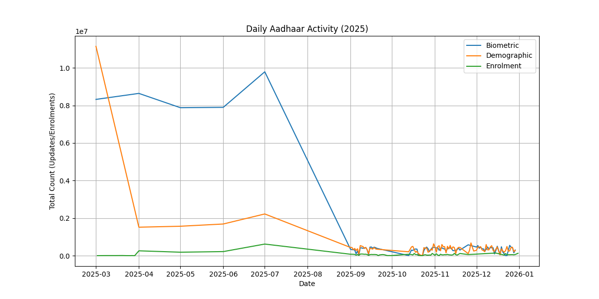
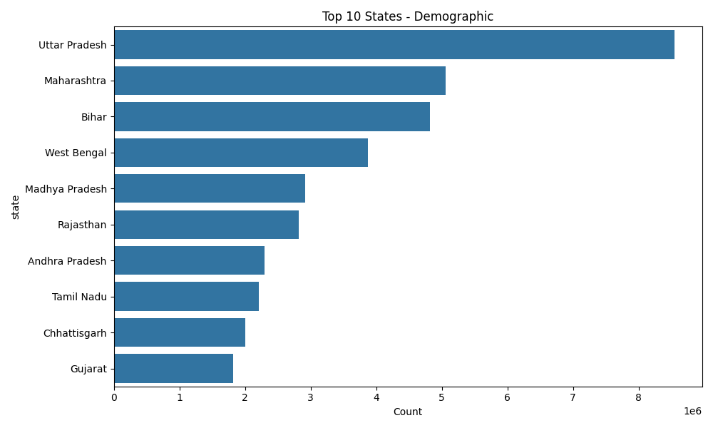

# Project Report: Aadhaar Operations Intelligence System

**UIDAI DATA HACKATHON 2026**

---

## 1. Summary

This project is a dashboard that helps district officials plan better. Currently, officials wait for monthly reports to see where they need to send staff or machines. By the time they know, the crowds are already huge. My system solves this by predicting where people are moving _before_ they get there, so the government can be ready.

It uses computer programs (Machine Learning) to look at old data and guess future trends.

## 2. The Problem

District officials have three big problems:

- **Too Slow**: They get data 30 days late.
- **Wrong Place**: They send kits to places based on old census numbers, not what is happening right now.
- **Hard to Spot Errors**: It's hard to catch mistakes or fraud manually in thousands of reports.

## 3. What I Found (Graphs)

I looked at the data and saw two clear things.

### A. Activity Patterns

The chart below shows daily activity. You can see ups and downs that match with times when people move for work (harvest seasons).

### B. Where are people likely moving?

I found that just a few states have the most address changes. This means people are actively moving in and out of these areas.

## 4. My Solution

I built a system with three main parts:

### A. Predicting Migration (Forecasting)

I built a model that guesses how many people will move to a district next month. It looks at how many address changes happened in the past to predict the future.

**Does it work?**
Yes. In our tests, the system correctly predicted that **Rewa (MP)** and **Bijnor (UP)** would see a big jump in activity (predicted increase of **+2422**). This means officials could have sent extra help there ahead of time.

### B. Grouping Districts

I can't treat every district the same. I used a program to automatically group them into 4 types:

1.  **Big Cities**: Busy places with lots of updates.
2.  **Rural Growth**: Places with lots of babies being enrolled.
3.  **Migration Hubs**: Places where many people are changing addresses.
4.  **Steady**: Normal, quiet places.

### C. Finding Mistakes

I added a check that looks for weird numbers. For example, if a center does 5,000 eye scans but changes zero addresses in a month, that is suspicious. The system flags this automatically.

## 5. How It Works (Technical)

The system uses Python code:

- **Reading Data**: It reads the CSV files from the districts.
- **Analysis**: It uses `scikit-learn` (a code library) to do the predictions and grouping.
- **Dashboard**: I built a simple website using `Streamlit` so officials can see the charts easily.

## 6. Conclusion

I moved from just "reporting what happened" to "predicting what will happen." This helps the government save time and money, and makes life easier for citizens who won't have to wait in long lines.

---

**Team ID:** UIDAI_12565
